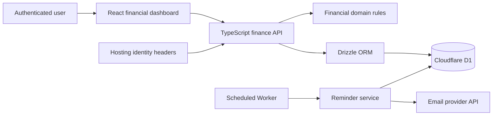

# ORBELION Finance Portal

## Overview

ORBELION Finance Portal is a full-stack financial management application for tracking accounts, transactions, budgets, debts, payables, and receivables in CRC and USD. This public repository is a sanitized technical case study: it contains representative domain logic, a generic data model, synthetic examples, and architecture documentation—not production source or customer data.

## Business Problem

Financial information is often split across accounts, recurring commitments, informal receivables, and category-based budgets. The portal consolidates those records into one authenticated workspace and presents operational indicators that can be understood without inspecting raw transactions.

## Solution

The application provides a responsive dashboard backed by server-side APIs and a per-user relational data model. It calculates balances and financial KPIs from recorded movements, links payments to obligations, manages monthly budgets, and schedules due-date reminders.

## Architecture

## Key Financial Capabilities

- Accounts for cash, checking, savings, investments, credit cards, and loans.
- Income, expense, and transfer records with account balance calculation.
- Debts, payables, and receivables with partial payments and status tracking.
- Monthly recurring payables and due-date alerts.
- Category budgets by month and currency.
- KPIs for liquidity, income, expenses, cash flow, net worth, debt, available credit, payables, receivables, and savings rate.
- Expense and income distribution by category.
- Create, update, and delete workflows for the main financial records.

## Technology Stack

- TypeScript
- React 19 and the Next.js-compatible vinext app router
- Cloudflare Workers and scheduled events
- Cloudflare D1 (SQLite)
- Drizzle ORM
- Vite, ESLint, and Node.js tests
- Resend email API
- Progressive Web App manifest and service worker

## Data Flow

1. The hosting layer supplies the signed-in user's identity headers.
2. The React client requests a monthly, currency-specific finance snapshot.
3. The API scopes reads and writes by `user_id` and validates supported currencies and entity types.
4. Transactions are applied to account balances; liability accounts use the appropriate accounting direction.
5. Open obligations and monthly transactions feed the KPI calculations returned to the dashboard.
6. A scheduled Worker checks upcoming or overdue obligations and records reminder attempts before calling the email provider.

The verified implementation stores portal records directly in D1. No Power BI code or dashboard is part of this repository, and no ETL pipeline is represented as part of the application.

## Application Modules

| Module | Verified responsibility |
| --- | --- |
| Summary | Financial snapshot, KPI cards, category distributions, and recent activity |
| Movements | Income, expenses, transfers, editing, and deletion |
| Accounts | Asset and liability account management and calculated balances |
| Budgets | Monthly category limits by currency |
| Debts | Balances, interest basis points, due dates, and payments |
| Payables | One-time or monthly commitments and payment registration |
| Receivables | Outstanding amounts and collection registration |
| Reports | Period and category-oriented financial presentation |
| Reminders | Upcoming and overdue payment notifications |

## API / Data Integrations

- `GET /api/finance`: returns the authenticated user's snapshot for a month and currency.
- `POST /api/finance`: creates accounts, transactions, obligations, budgets, or obligation payments.
- `PATCH /api/finance`: updates supported records while preserving user ownership checks.
- `DELETE /api/finance`: removes supported records; account deletion is implemented as deactivation.
- Cloudflare D1 is accessed through Drizzle ORM and prepared statements.
- Scheduled Workers invoke the reminder workflow; Resend is the verified outbound email integration.

## Authentication & Security

Authentication is delegated to the hosting platform, which injects stable user ID and email headers after sign-in. API operations reject missing identity in hosted requests and scope database reads and mutations to the authenticated user. Redirect helpers accept only same-origin relative return paths.

This case study intentionally excludes credentials, deployment identifiers, production URLs, personal email addresses, private infrastructure configuration, and real financial data. The included environment file contains placeholders only.

## Screenshots

Safe screenshots can be added under [`screenshots/`](screenshots/) after replacing all financial values and identity fields with synthetic data. See the folder instructions for the required review checklist.

## Engineering Decisions

- Monetary values are stored as integer minor units to avoid floating-point rounding errors.
- CRC and USD records remain explicitly currency-scoped; the portal does not imply automatic FX conversion.
- Linked obligation payments create accounting movements and adjust the outstanding balance together.
- Month-end recurrence is clamped to a valid calendar date.
- Reminder keys and logs prevent duplicate sends for the same obligation and reminder window.
- Date-sensitive rules use the application business timezone (`America/Costa_Rica`).

## Project Context

This repository was created from a private working application to demonstrate verified full-stack and financial-domain engineering decisions without exposing its deployment surface. It is a portfolio case study and safe code sample, not a production distribution. Power BI belongs to a separate portfolio project.

## Author

Axel Ortega
